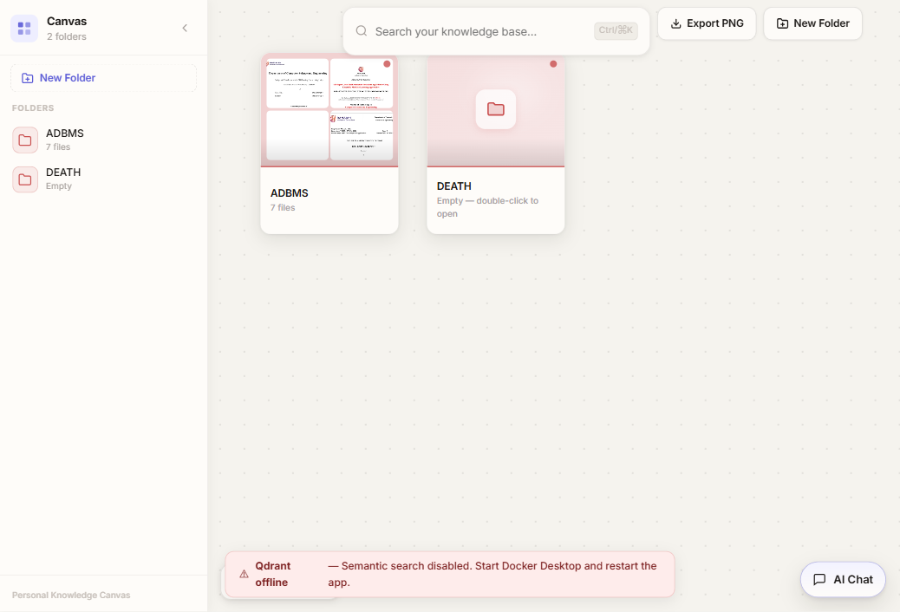

# Personal Canvas

A local-first desktop knowledge canvas for organizing files, searching content, and chatting with your data.



## Features

- Infinite canvas for folder-level organization
- Drag/drop and bulk file import
- File previews and metadata-aware cards
- Hybrid search support (keyword + semantic when Qdrant is available)
- Chat panel with file context
- Desktop packaging with Tauri

## Tech Stack

- Frontend: React + Vite + tldraw
- Backend: Node.js + Fastify + TypeScript
- Desktop shell: Tauri (Rust)
- Metadata DB: SQLite
- Vector DB: Qdrant (Docker)

## Project Structure

```text
personal-canvas/
|- frontend/        # React app
|- backend/         # Fastify API + ingest/search/chat services
|- src-tauri/       # Tauri desktop shell
|- storage/         # Local runtime data (ignored)
|- scripts/         # Build/packaging helper scripts
|- docker-compose.yml
`- start.bat
```

## Prerequisites

- Node.js 20+
- npm 10+
- Docker Desktop (required for Qdrant/semantic search)
- Rust toolchain + Tauri prerequisites (only for desktop build)

## Environment

Create `backend/.env` (or project root `.env`) for your keys/settings.

Typical variables used by the backend include:

- `GROQ_API_KEY`
- `OLLAMA_BASE_URL`
- `QDRANT_URL` (defaults to `http://127.0.0.1:6333` in most setups)
- `BACKEND_STORAGE_ROOT` (optional custom storage path)

## Run In Development

1. Install dependencies:

```bash
cd backend && npm install
cd ../frontend && npm install
```

2. Start backend:

```bash
cd backend
npm run dev
```

3. Start frontend:

```bash
cd frontend
npm run dev -- --host 127.0.0.1 --port 5173
```

4. Open app in browser:

- `http://127.0.0.1:5173`

## One-Command Local Start (Windows)

Use:

```bat
start.bat
```

This script attempts to:

- start Qdrant via Docker
- build backend
- launch backend + frontend

## Tauri Desktop (Optional)

From project root:

```bash
npm install
npx tauri dev
```

For release build:

```bash
npx tauri build
```

## Notes

- If Docker/Qdrant is down, the app still runs but semantic search is disabled.
- Runtime data under `storage/` is local and intentionally not committed.
- Build artifacts (`dist/`, `target/`, `node_modules/`) are generated and can be recreated.
